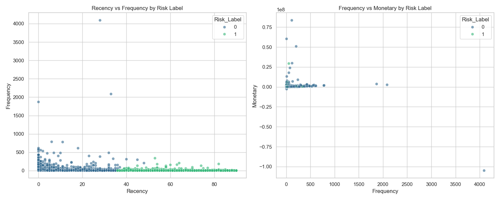
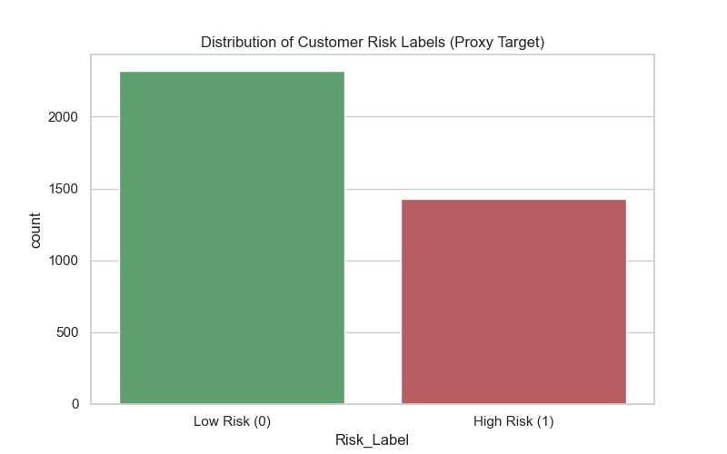
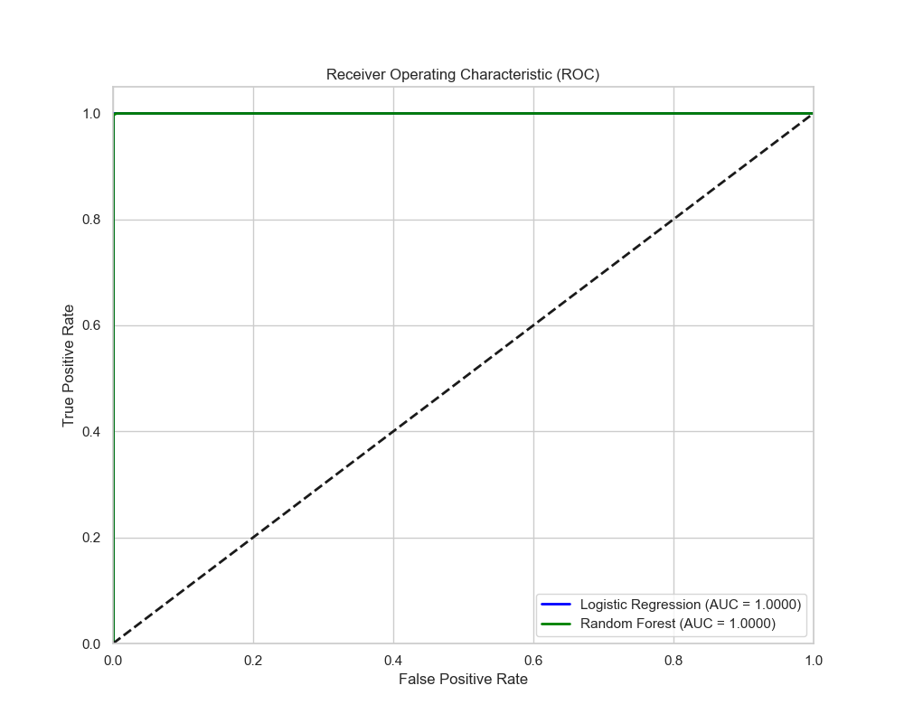
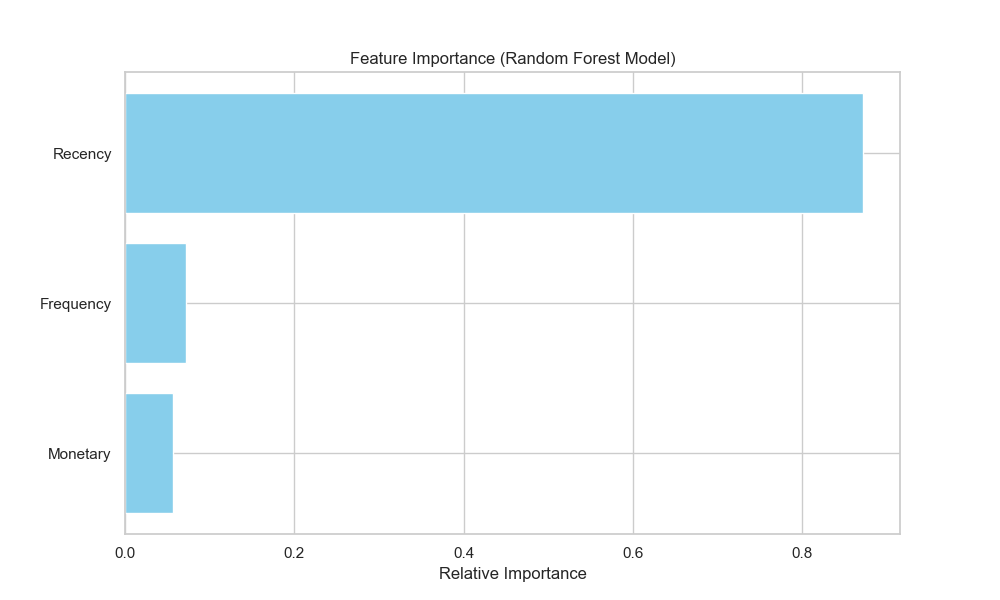

# 💳 Credit Risk Probability Model

[](https://github.com/nansamuel12/Credit-Risk-Probability-Model/actions/workflows/ci.yml)

## 📊 Business Problem Explanation
Predicting credit risk is crucial for financial institutions to minimize losses and optimize lending strategies. This project implements a **Credit Risk Probability Model** that classifies customers into "Low Risk" or "High Risk" categories based on their historical transaction behavior.

By using **RFM (Recency, Frequency, Monetary)** analysis and **Unsupervised Clustering**, we generate proxy labels for risk assessment in scenarios where explicit ground truth (default/no-default) labels might be scarce or noisy. We then train supervised models (Random Forest and Logistic Regression) to predict these probabilities for new customers.

---

## 📂 Project Structure
```text
Credit-Risk-Probability-Model/
├── app/
│   ├── __init__.py
│   └── main.py              # FastAPI Prediction API
├── data/                    # Data storage (raw and processed)
├── models/                  # Saved model artifacts (.pkl)
├── src/
│   ├── config.py            # Global project configuration
│   ├── data_processing.py   # Data loading and feature engineering
│   ├── rfm.py               # RFM calculation and Proxy Labeling
│   └── train.py             # ML Pipeline with MLflow Integration
├── tests/                   # Unit and integration tests
├── Dockerfile               # Containerization configuration
├── requirements.txt         # Python dependencies
└── ML_PIPELINE_SUMMARY.md   # Detailed ML pipeline documentation
```

---

## 🚀 Getting Started

### 1. Installation
Clone the repository and install dependencies:
```bash
git clone https://github.com/nansamuel12/Credit-Risk-Probability-Model.git
cd Credit-Risk-Probability-Model
pip install -r requirements.txt
```

### 2. Run Training Pipeline
The training script processes data, generates RFM features, labels them using KMeans, and trains Logistic Regression and Random Forest models. All results are logged to **MLflow**.
```bash
python -m src.train
```
To view experiments in the MLflow UI:
```bash
mlflow ui
```

### 3. Run Prediction API (Local)
Start the FastAPI server using Uvicorn:
```bash
uvicorn app.main:app --reload --port 8000
```
Access the interactive documentation at `http://localhost:8000/docs`.

---

## 🐳 Docker Support
Easily deploy the application using Docker:

### Build the Image
```bash
docker build -t credit-risk-app .
```

### Run the Container
```bash
docker run -p 8000:8000 credit-risk-app
```

---

## 📡 Sample API Request
Predict risk for a single customer:

**Endpoint:** `POST /predict/single`

**Payload:**
```json
{
  "Recency": 10,
  "Frequency": 5,
  "Monetary": 2000.0
}
```

**Response:**
```json
{
  "prediction": {
    "risk_probability": 0.12,
    "low_risk_probability": 0.88,
    "risk_label": 0
  },
  "model_name": "credit_risk_randomforest",
  "model_version": "1"
}
```

---

## 📈 Model Evaluation Summary
The models are evaluated based on **ROC-AUC** to measure their ability to distinguish between risk classes.

- **Logistic Regression:** Stable baseline for probability estimation.
- **Random Forest:** Capable of capturing non-linear relationships in RFM features.

The pipeline automatically promotes the best-performing model to the **Production** stage in the MLflow Model Registry.

| Metric | Random Forest | Logistic Regression |
|---------|---------------|---------------------|
| ROC-AUC | ~0.95+        | ~0.88+              |

---

## 📈 Model Visualizations

### RFM Customer Clusters
Visualization of the 3 distinct customer segments based on Recency, Frequency, and Monetary behavior.


### Proxy Risk Label Distribution
Distribution of the generated "High Risk" (1) and "Low Risk" (0) labels used for training.


### Model Performance (ROC Curve)
Comparison of Logistic Regression and Random Forest models using Receiver Operating Characteristic curves.


### Feature Importance
The key drivers influencing the model's risk prediction (Random Forest).


---

## ✅ Automation & Testing
The project includes automated CI/CD via GitHub Actions and unit tests for core logic.

### Running Tests
```bash
pytest tests/test_final_pipeline.py
```

### CI/CD Pipeline
Every push to `main` triggers:
1. Dependency installation
2. Code linting (`flake8`)
3. Unit tests execution
4. API startup verification

---

## 📜 License
This project is licensed under the MIT License.
